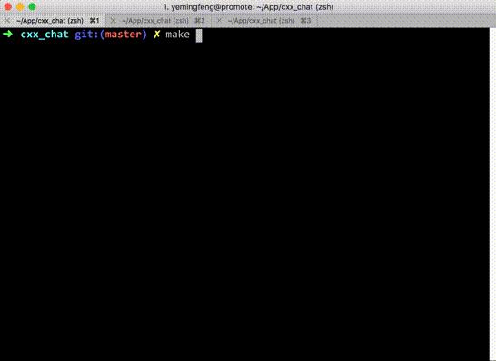

##### CXX_CHAT

###### descritpion
- base on [libuv](https://github.com/libuv/libuv)
- tcp server

###### show

###### server
- install libuv
- build make
- ./main.out
- server listen on 6002

###### client
- nc localhost 6002

